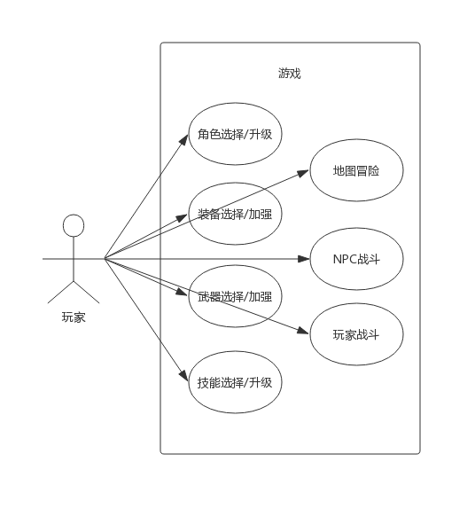

## 项目文档

## 1. 需求

### 1.1 用例分析

#### 1.1.1 用例图

#### 1.1.2 用例说明

| 用例名称      | 用例说明                                                     |
| ------------- | ------------------------------------------------------------ |
| 角色选择/升级 | 1. 玩家在游戏开始时需要选择类型（职业）不同的角色 2. 不同类型的角色有不同的基础属性和属性成长 3. 随着游戏的进行，玩家可以获得经验，每升一级可以获得一定属性成长 |
| 装备选择/加强 | 1. 不同类型的角色可选择的装备不同 2. 随着游戏的进行，玩家可以获得装备升级点，对装备进行升级 |
| 武器选择/加强 | 1. 不同类型的角色可选择的武器不同 2. 随着游戏的进行，玩家可以获得武器升级点，对武器进行升级 |
| 技能选择/加强 | 1. 不同类型的角色可选择的技能不同 2. 玩家每升一级可以获得一定的技能点，用于学习新技能或升级技能 3. 战斗中可使用的技能数目是有限的 |
| 地图冒险      | 1. 玩家可以在一张有限的迷宫上冒险 2. 迷宫的一些关隘处有NPC怪物 3. 冒险过程中可能会出现奖励物品（生命/装备/武器升级点/技能点） |
| NPC战斗       | 1. 回合制战斗，速度影响双发角色进度条走动 2. 每个回合可以进行的操作包括普通攻击，技能以及逃跑 3. 战斗胜利时，玩家将获得经验奖励，一定几率获得其他奖励 4. 战斗失败时，游戏结束 5. 逃跑有一定几率成功，成功时算作直接结束战斗，失败时该回合浪费 |
| *玩家战斗     | 1. 采用对战房形式，联网与其他玩家进行战斗 2. 等级差距在1级以内的才可以进行战斗 3. 战斗胜利与否只会记录不会有其他作用 4. 玩家战斗的逃跑操作算作投降 |

### 1.2 功能需求列表

| #    | 功能需求 | 说明                                                         |
| ---- | -------- | ------------------------------------------------------------ |
| 1    | 角色系统 | 1. 需要设计多个角色 2. 需要给每个角色设计基础属性和属性成长 |
| 2    | 武器系统 | 1. 需要给每个角色设计不同的武器 2. 需要给每个武器设计初始加成和加成成长 |
| 3    | 装备系统 | 1. 需要设计不同的装备 2. 需要给每个装备设计初始加成和加成成长 |
| 4    | 技能系统 | 1. 需要为每个角色设计不同的技能 2. 需要为每个技能设计初始效果和升级之后的效果 |
| 5    | 地图系统 | 1. 需要设计整张迷宫 2. 需要设计各种NPC和奖励物品          |
| 6    | 战斗系统 | 1. 需要设计战斗场景 *2. 需要设计联网模式战斗              |

### 1.3 可能的需求变化

1. 新增/修改/删除角色，例如添加角色刺客
2. 新增/修改/删除角色属性，例如添加反击几率，吸血率等
3. 新增/修改/删除武器
4. 新增/修改/删除装备
5. 修改武器，装备，角色的适配性，例如某些武器只能由某特定角色持有，某些装备有最低（高）等级限制
6. 新增/修改/删除技能，例如添加控制技能，被动技能等
7. 修改地图，例如修改物品掉落
8. 修改战斗模式，例如从简单回合制变成进度条回合制，添加防御操作，添加每次战斗恢复生命魔法等
9. 添加其他子系统，例如交易系统，任务系统，账户系统

## 2. 设计

### 2.1 游戏设计

> 角色部分借鉴**Dota2**，地图部分借鉴**魔塔**，战斗部分借鉴**仙剑1**

#### 2.1.1 角色设计

##### 2.1.1.1 角色属性概览

| 属性         | 影响方面                                                     | 备注           |
| ------------ | ------------------------------------------------------------ | -------------- |
| 基础生命     | 生命大于0时表示角色存活                                      | 每次战斗不恢复 |
| 基础速度     | 战斗中速度高的角色进行第一次动作，并且影响miss率和逃跑成功率 | 计算公式1      |
| 基础攻击     | 基本攻击的伤害                                               | 上下3点浮动    |
| 基础暴击率   | 基本攻击可以暴击，暴击时2倍伤害                              | 百分数         |
| 基础防御     | 对敌方攻击的防御值                                           | 计算公式2      |
| 基础技能增强 | 技能伤害的增强比率                                           | 百分数         |

计算公式1：miss率（逃跑成功率）=1-1/(100+速度)

计算公式2：防御比率=1-1/(50+防御值)

##### 2.1.1.2 职业设计

| 职业 | 生命   | 攻击  | 暴击率 | 防御  | 技能增强 |
| ---- | ------ | ----- | ------ | ----- | -------- |
| 战士 | 100/20 |  40/10 | 20/5   | 40/20 | 0/2      |
| 法师 | 70/10  |  20/5  | 0/2    | 30/10 | 10/5     |

#### 2.1.2 装备设计

| 装备名称 | 属性加成                                    |
| -------- | ------------------------------------------- |
| 活力球   | 200生命                                     |
| 攻击指环 | 60攻击力                                    |
| 暴击指环 | 30暴击率                                    |
| 护甲     | 60防御                                      |
| 辉光     | 50技能增强                                  |
| 假腿     | 35速度 5技能增强 15暴击率 20攻击力 |
| 赤红甲   | 160生命 40防御                           |
| 水晶剑   | 40攻击力 15暴击率                        |

#### 2.1.3 武器设计

| 角色 | 武器         | 效果                  | 可加强配件及效果                                             |
| ---- | ------------ | --------------------- | ------------------------------------------------------------ |
| 战士 | 盾牌 大剑 | 50防御 40攻击      | 精力护盾+80生命/玄武护盾+30防御 剑格+15暴击/剑穗+70速度/剑刃+30攻击 |
| 法师 | 法杖 法典 | 40技能增强 200生命 | 羽毛+20技能增强/冰片+20防御 残页+15技能增强/封面+100生命  |

#### 2.1.4 技能设计

| 角色 | 技能                 | 基础伤害/伤害加成       |
| ---- | -------------------- | ----------------------- |
| 战士 | 冲刺 踩踏 格斗 | 60/20 45/25 30/30 |
| 法师 | 雷电 狂风 烈火 | 50/20 35/30 20/40 |

#### 2.1.5 地图设计

#### 2.1.6 战斗设计

### 2.2 项目设计

#### 2.2.1 高层架构视图

MVC模式

#### 2.2.1 低层类图

策略模式 状态模式 模板方法模式 工厂方法模式 观察者模式 单例模式 门面模式

