## 项目文档

## 1. 需求

### 1.1 用例分析

#### 1.1.1 用例图

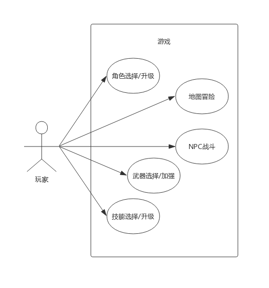

#### 1.1.2 用例说明

| 用例名称      | 用例说明                                                     |
| ------------- | ------------------------------------------------------------ |
| 角色选择/升级 | 1. 玩家在游戏开始时需要选择类型（职业）不同的角色<br>2. 不同类型的角色有不同的基础属性和属性成长<br>3. 随着游戏的进行，玩家可以获得经验，每升一级可以获得一定属性成长 |
| 装备选择/加强 | 1. 不同类型的角色可选择的装备不同<br>2. 随着游戏的进行，玩家可以获得装备升级道具，对装备进行加强 |
| 技能选择/加强 | 1. 不同类型的角色可选择的技能不同<br>2. 玩家每升一级可以获得一定的技能点，用于升级技能<br>3. 战斗中可使用的技能数目是有限的 |
| 地图冒险      | 1. 玩家可以在一张有限的迷宫上冒险<br>2. 迷宫的一些关隘处有NPC怪物<br>3. 冒险过程中可能会出现奖励物品（生命/装备/武器升级点/技能点） |
| NPC战斗       | 1. 回合制战斗<br>2. 每个回合可以进行的操作包括普通攻击和技能<br>3. 战斗胜利时，玩家将获得经验奖励，一定几率获得其他奖励<br>5. 战斗失败时游戏结束 |

### 1.2 功能需求列表

| #    | 功能需求 | 说明                                                         |
| ---- | -------- | ------------------------------------------------------------ |
| 1    | 角色系统 | 1. 需要设计多个角色<br>2. 需要给每个角色设计基础属性和属性成长 |
| 2    | 武器系统 | 1. 需要设计不同的装备和装备配件<br/>2. 需要给每个装备设计初始属性和配件的属性 |
| 3    | 技能系统 | 1. 需要为每个角色设计不同的技能<br>2. 需要为每个技能设计初始效果和升级之后的效果 |
| 4    | 地图系统 | 1. 需要设计整张迷宫<br>2. 需要设计各种NPC和奖励物品          |
| 5    | 战斗系统 | 需要设计战斗场景                                             |

### 1.3 可能的需求变化

1. 新增/修改/删除角色，例如添加角色刺客
2. 新增/修改/删除角色属性，例如添加反击几率，吸血率等
3. 新增/修改/删除武器和武器配件
4. 修改武器，角色的适配性，例如某些武器只能由某特定角色持有
5. 修改地图
6. 修改战斗模式，例如从简单回合制变成进度条回合制，添加防御操作，添加每次战斗恢复生命魔法等

## 2. 设计

### 2.1 游戏设计

> 角色部分借鉴**Dota2**，地图部分借鉴**魔塔**，战斗部分借鉴**仙剑1**

#### 2.1.1 角色设计

##### 2.1.1.1 角色属性概览

| 属性         | 影响方面                         |
| ------------ | -------------------------------- |
| 基础生命     | 生命大于0时表示角色存活          |
| 基础速度     | 战斗中速度高的角色进行第一次动作 |
| 基础攻击     | 基本攻击的伤害                   |
| 基础暴击率   | 基本攻击可以暴击，暴击时2倍伤害  |
| 基础防御     | 对敌方攻击的防御值               |
| 基础技能增强 | 技能伤害的增强比率               |

##### 2.1.1.2 职业设计

| 职业 | 生命   | 攻击  | 暴击率 | 防御  | 技能增强 |
| ---- | ------ | ----- | ------ | ----- | -------- |
| 战士 | 100/20 |  40/10 | 20/5   | 40/20 | 0/2      |
| 法师 | 70/10  |  20/5  | 0/2    | 30/10 | 10/5     |


#### 2.1.2 武器设计

| 角色 | 武器 | 效果       | 可加强配件及效果                    |
| ---- | ---- | ---------- | ----------------------------------- |
| 战士 | 大剑 | 40攻击     | 剑格+15暴击/剑穗+70速度/剑刃+30攻击 |
| 法师 | 法杖 | 40技能增强 | 羽毛+20技能增强/冰片+20防御         |

#### 2.1.3 技能设计

| 角色 | 技能                 | 基础伤害/伤害加成       |
| ---- | -------------------- | ----------------------- |
| 战士 | 冲刺<br>踩踏<br>格斗 | 60/20<br>45/25<br>30/30 |
| 法师 | 雷电<br>狂风<br>烈火 | 50/20<br>35/30<br>20/40 |

#### 2.1.4 地图设计

暂时做的设计如下

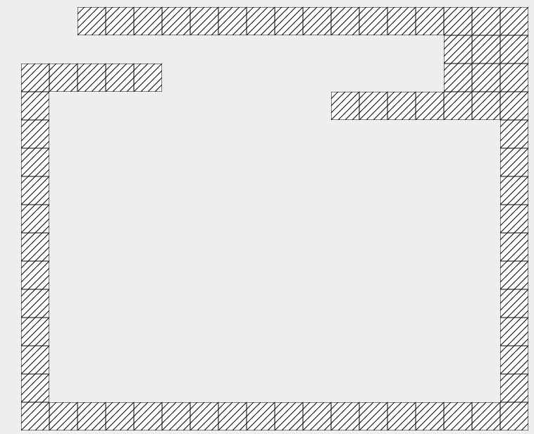

### 2.2 项目设计

#### 2.2.1 高层架构视图

项目总体上采用比较典型的MVC架构，高层架构图如下：

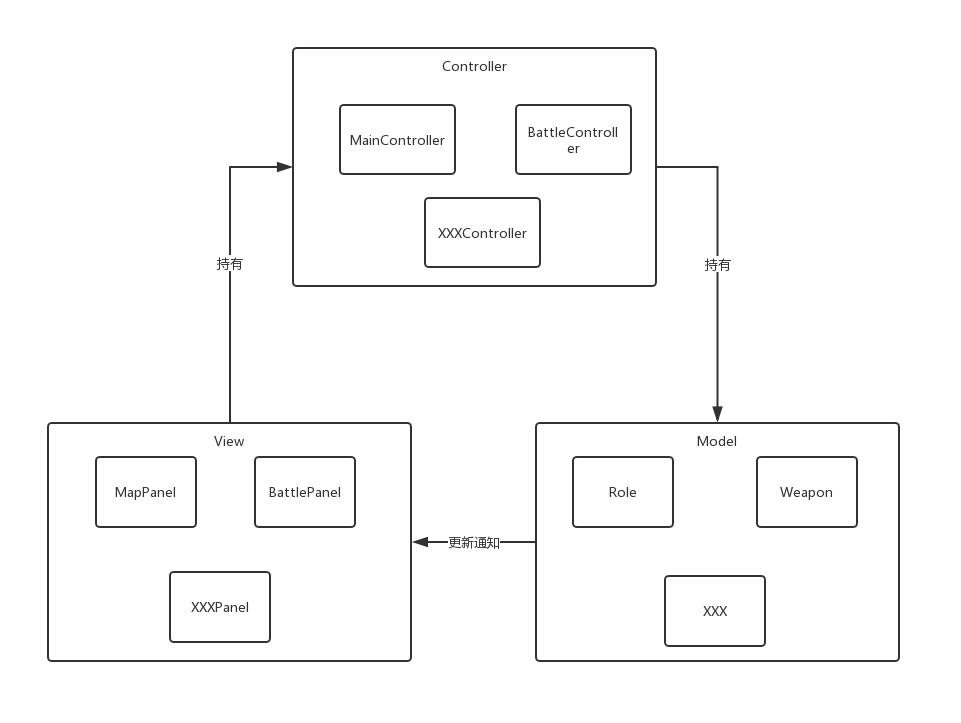

#### 2.2.2 低层类图

这一部分将详细介绍设计中采用的设计模式以及理由

##### 2.2.2.1 策略模式

策略模式使用较多，MVC模式中使用了典型的策略模式，即view层对象持有controller接口，当用户在图形界面上采取某些指令(例如敲击键盘)时，view层对象可以调用controller来处理这些指令，这些controller是动态可替换的。

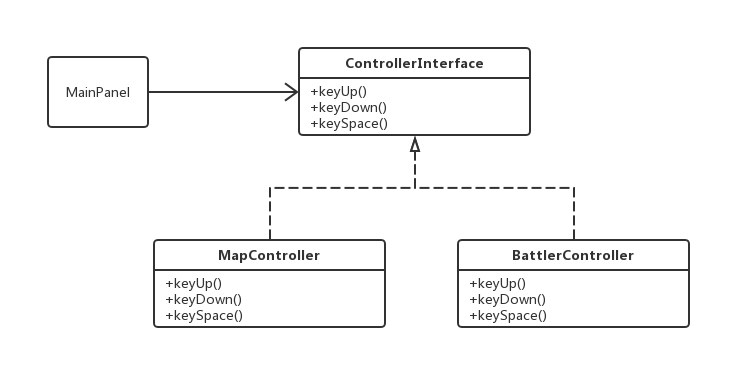

#####2.2.2.2 观察者模式

MVC模式中使用了典型的观察者模式，即模型是可以观察的主题，而视图注册成为这些模型的观察者，当模型变化时。模型会通知所有观察者，这样视图就可以动态更新内容。

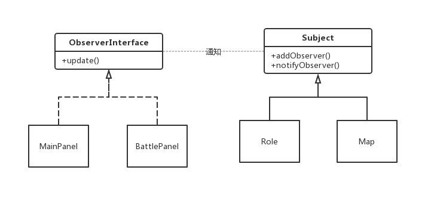

##### 2.2.2.3 装饰者模式

在设计武器及其配件时，很自然的想到装饰者模式，玩家拥有的武器可以动态添加这些配件的属性。

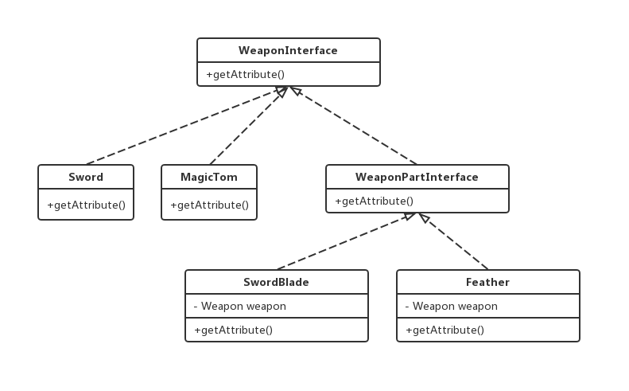

#####2.2.2.4 工厂方法模式

特定职业的角色只能装备特定的武器，学习特定的技能，如何根据职业动态生成武器和技能，这里使用了工厂方法模式。

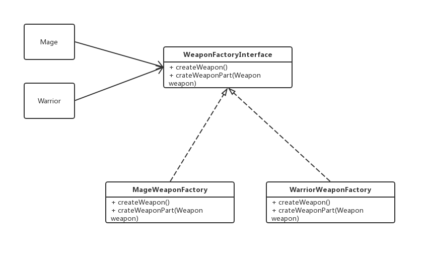

##### 2.2.2.5 模板方法模式

所有职业发出攻击和使用技能的有很多步骤，其中大部分步骤是一致的，只有少部分不一样，这里可以用模板方法模式。

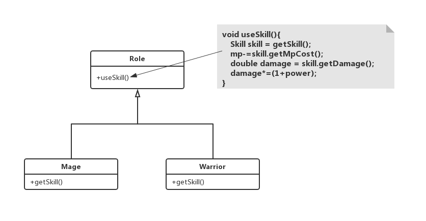

##### 2.2.2.6 组合模式

MVC模式中使用了典型的组合模式，即view层内部是组合的，view层包括了窗口，按钮等组件，当view层收到通知时，只有最高层组件会接收到通知，下面的各个组件会根据需要update自己。

这一部分的类图就是Java Swing的类图。

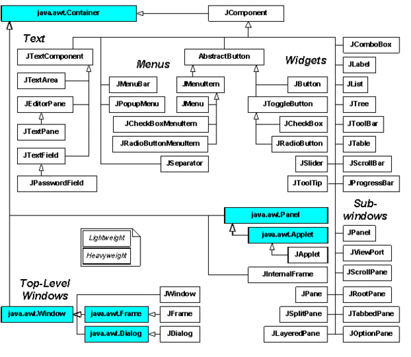

##### 2.2.2.7 单例模式

controller部分使用了单例模式。

```java
public class BattleController {
    public static BattleController instance;

    private BattleController() {
    }

    public static BattleController getInstance() {
        if (instance == null) {
            instance = new BattleController();
        }
        return instance;
    }
}
```

##### 2.2.2.8 状态模式

玩家在游戏中有不同的状态，基于这些状态，玩家会有不同的表现，例如造成的伤害变化等。这里我们使用了状态模式。

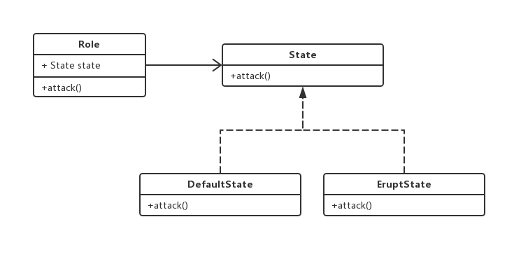

##### 2.2.2.9 门面模式

玩家攻击怪物是一个复杂的过程，涉及到状态切换，伤害计算等，这里使用门面模式，封装了底层的细节。

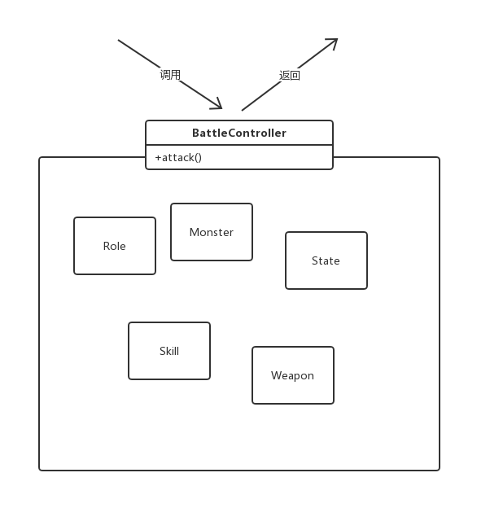

### 2.3  需求变化时的改动量

1. 新增/修改/删除角色，例如添加角色刺客
   1. 需要新增一个角色类，继承`Role`抽象类，实现一些方法
   2. 需要给这个角色设计属性，并写入properties文件中
   3. 需要给这个角色设计技能工厂和装备工厂
2. 新增/修改/删除角色属性，例如添加反击几率，吸血率等
   1. 需要在`Role`类中添加对应属性
   2. 需要修改战斗流程，添加一个方法即可
3. 新增/修改/删除武器和武器配件
   1. 新建一个类继承`Weapon`或者`WeaponParts`即可
4. 修改武器，角色的适配性，例如某些武器只能由某特定角色持有
   1. 修改工厂方法返回的值即可
5. 修改地图
   1. 修改地图生成器中的数组即可
6. 修改战斗模式，例如从简单回合制变成进度条回合制，添加防御操作，添加每次战斗恢复生命魔法等
   1. 修改战斗流程，添加一个方法即可

## 3. 实现

这里贴出几张图展示一下

游戏开始

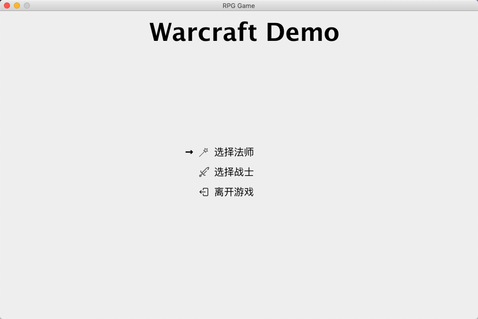

地图冒险

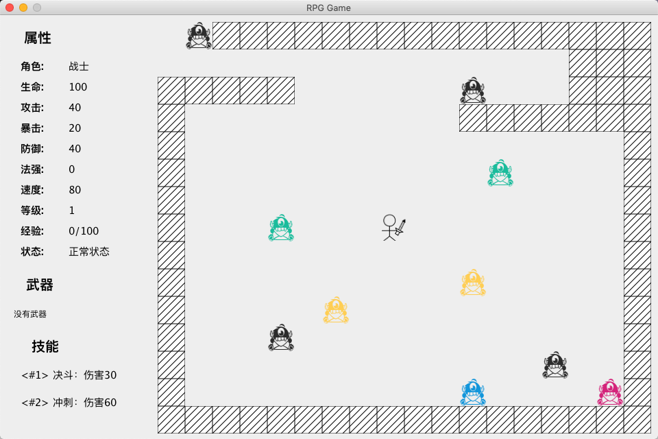

战斗中

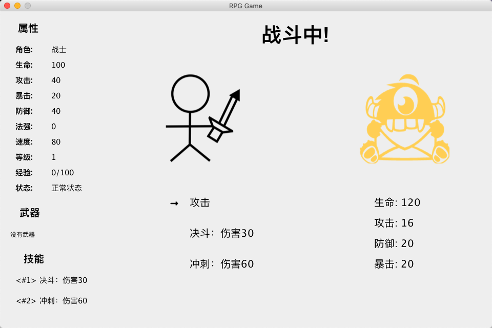

战斗成功

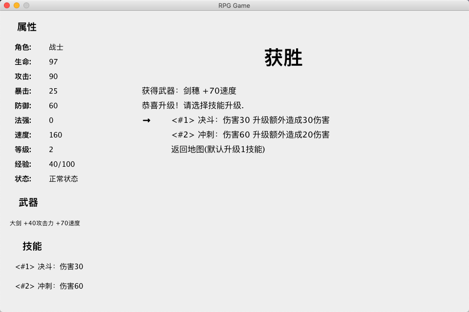

## 4. 操作说明

纯键盘操作，上下左右控制移动，空格选定